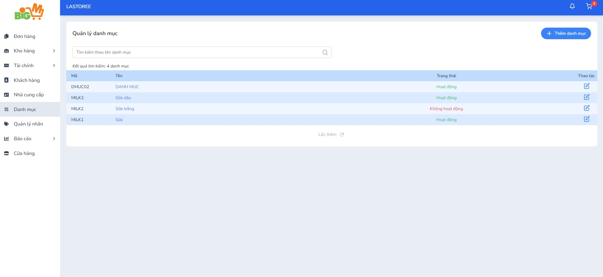
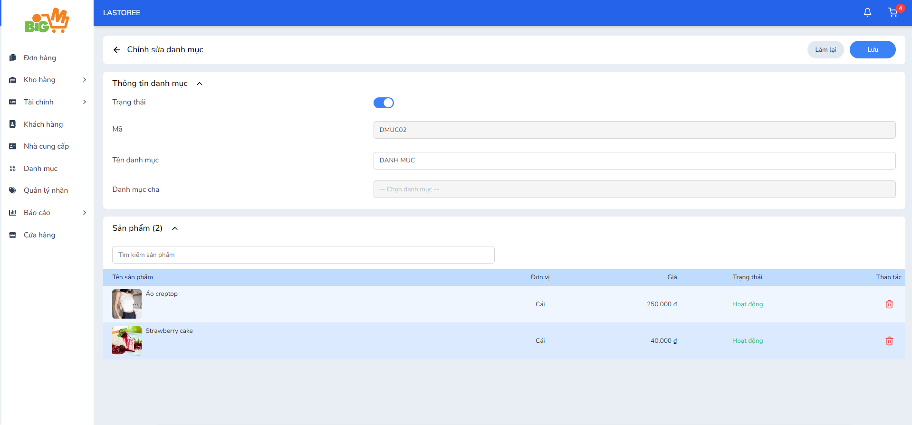

#  CHỈNH SỬA DANH MỤC 

### **Bước 1: Chọn vào tên danh  mục bạn muốn chỉnh sửa**

### **Bước 2: Chỉnh sửa thông tin**

*Không thể chỉnh sửa danh mục cha*

### **Bước 3: Chọn "Lưu" để hoàn tất, chọn "Làm lại" để thao tác lại**