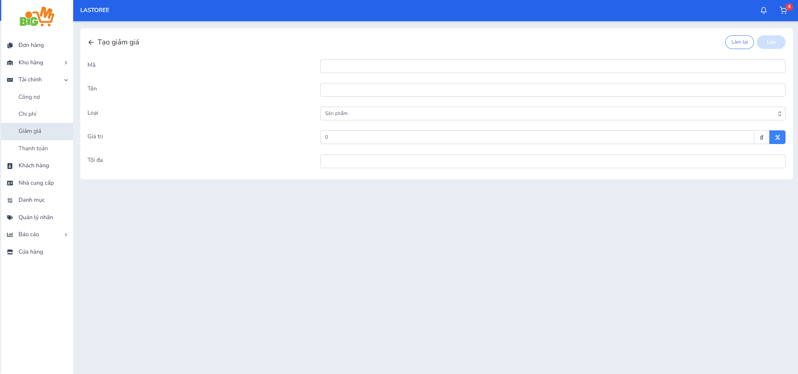

#  TẠO GIẢM GIÁ 

### **Bước 1: Chọn "Tạo giảm giá"**

### **Bước 2: Nhập thông tin của giảm giá**

Có 3 loại giảm giá bao gồm:

- Sản phẩm: Giảm giá được dùng cho sản phẩm
- Đơn hàng: Giảm giá được dùng cho đơn hàng
- Chi phí: Giảm giá được dùng cho chi phí

### **Bước 3: Chọn "Lưu" để hoàn tất. Chọn "Làm lại" để thao tác lại**