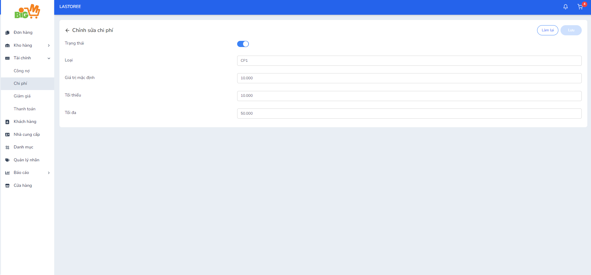

#  CHỈNH SỬA CHI PHÍ 

### **Bước 1: Chọn vào loại chi phí bạn muốn chỉnh sửa**

### **Bước 2: Chỉnh sửa thông tin của chi phí**

### **Bước 3: Chọn "Lưu" để hoàn tất. Chọn "Làm lại" để thao tác lại**