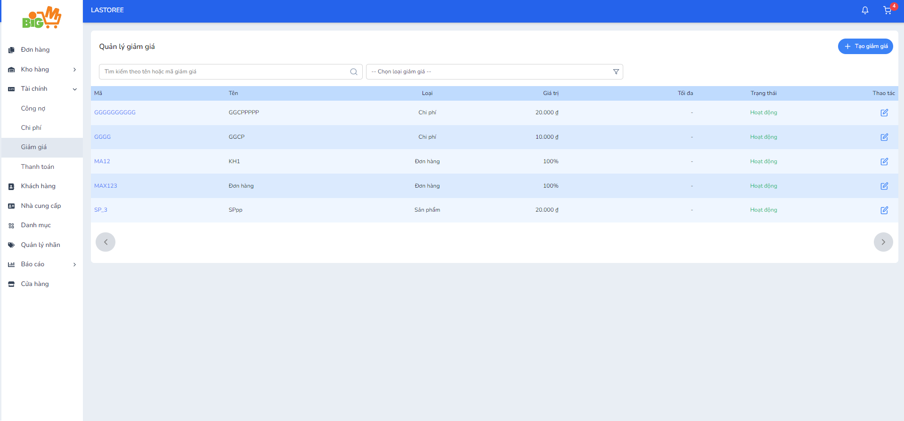
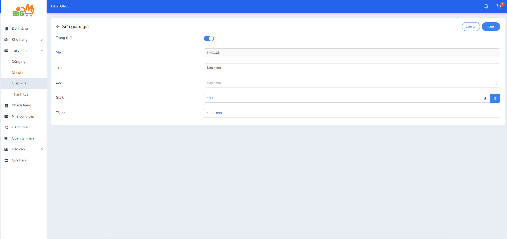

#  CHỈNH SỬA GIẢM GIÁ 

### **Bước 1: Chọn vào mã của giảm giá bạn muốn thay đổi**

### **Bước 2: Chỉnh sửa thông tin của giảm giá**

*Không thể chỉnh sửa loại của giảm giá*

### **Bước 3: Chọn "Lưu" để hoàn tất. Chọn "Làm lại" để thao tác lại**