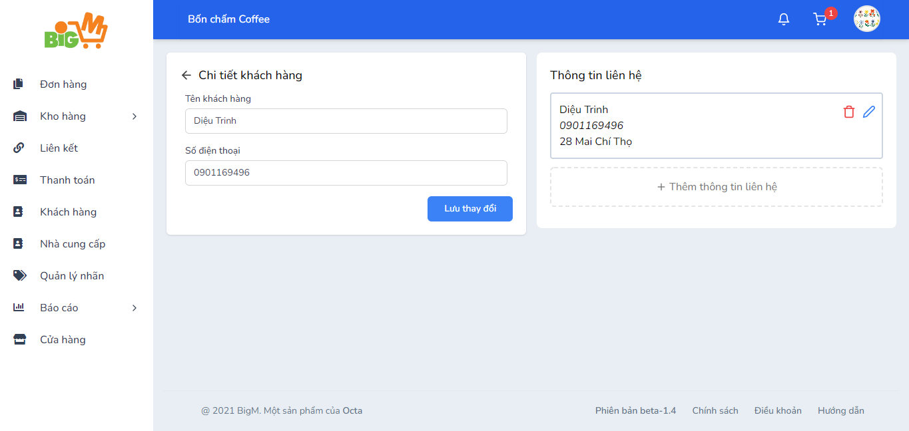

#  THÊM THÔNG TIN LIÊN HỆ 

### **Bước 1: Chọn chức năng "Thêm thông tin liên hệ"**

### **Bước 2: Nhập thông tin liên hệ của khách hàng:**

- Tên liên lạc
- Số điện thoại
- Địa chỉ
- Nhãn

### **Bước 3: Chọn "Lưu" để hoàn tất**