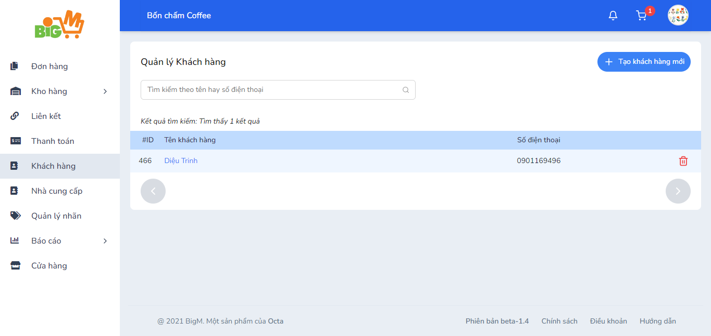
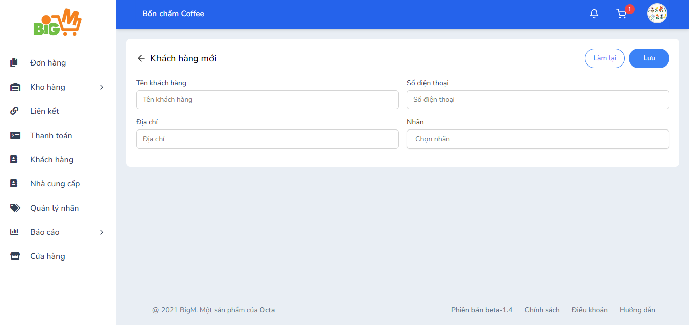

#  TẠO KHÁCH HÀNG MỚI 

### **Bước 1: Chọn chức năng "Tạo khách hàng mới"**

### **Bước 2: Nhập thông tin của khách hàng:**

- Tên khách hàng
- Số điện thoại
- Địa chỉ
- Nhãn

### **Bước 3: Chọn "Lưu" để hoàn tất, chọn "Làm lại" để thao tác lại**