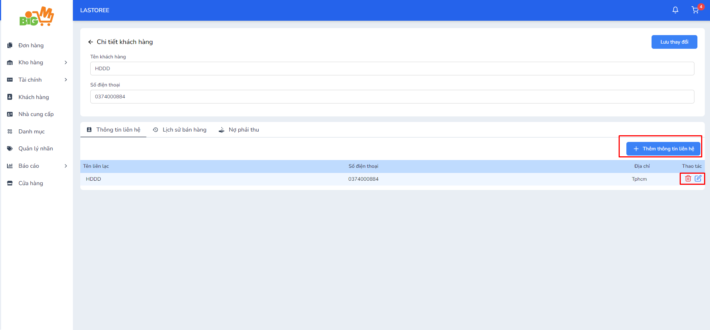

#  CHỈNH SỬA THÔNG TIN LIÊN HỆ 

### **Bước 1: Chọn vào mã khách hàng mà bạn muốn chỉnh sửa thông tin liên hệ**

### **Bước 2: Chỉnh sửa thông tin liên hệ **
 
 - Chọn biểu tượng màu xanh để chỉnh sửa thông tin liên hệ
 - Chọn biểu tượng màu đỏ để xóa thông tin liên hệ
 - Chọn vào khung "Thêm thông tin liên hệ" nếu bạn muốn tạo thêm thông tin liên hệ

### **Bước 3: Chọn "Lưu" để hoàn tất**