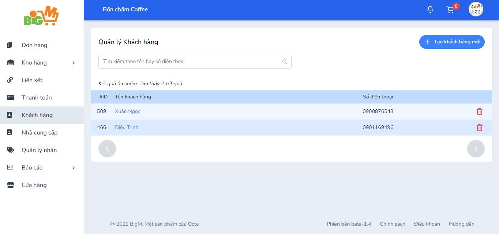

#  CHỈNH SỬA CHI TIẾT KHÁCH HÀNG/NHÀ CUNG CẤP 

### **Bước 1: Chọn vào tên khách hàng/nhà cung cấp mà bạn muốn chỉnh sửa hoặc bạn có thể nhập thông tin vào khung tìm kiếm**

### **Bước 2: Chỉnh sửa thông tin khách hàng/nhà cung cấp trong "Chi tiết khách hàng", "Chi tiết nhà cung cấp": **

- Chọn "Thêm thông tin liên hệ" để thêm thông tin liên hệ cho khách hàng/Nhà cung cấp
- Các thao tác xóa, sửa thông tin liên hệ ở cột Thao tác

### **Bước 3: Chọn "Lưu thay đổi" để hoàn tất**
