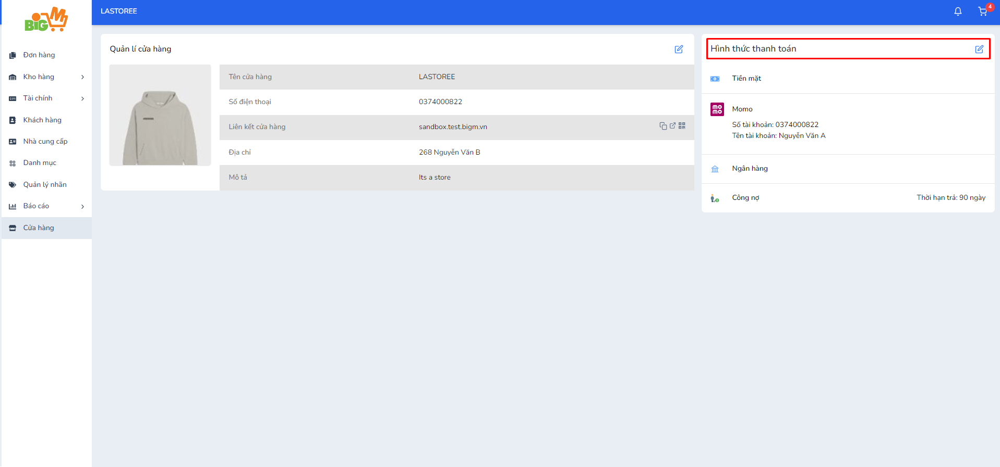
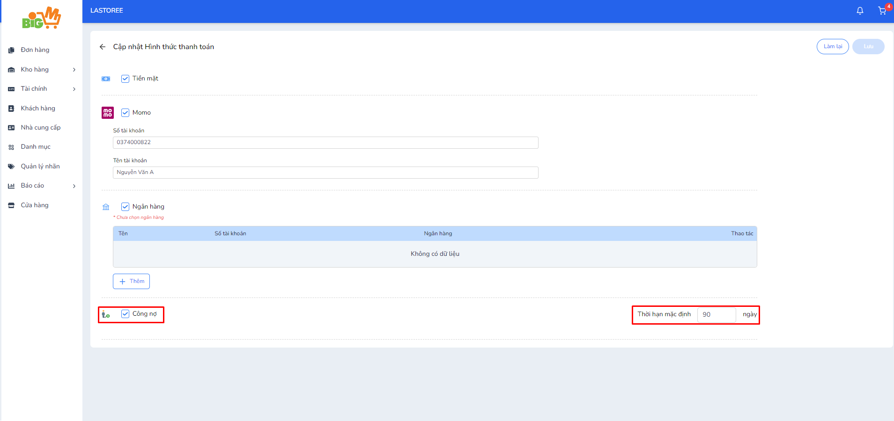
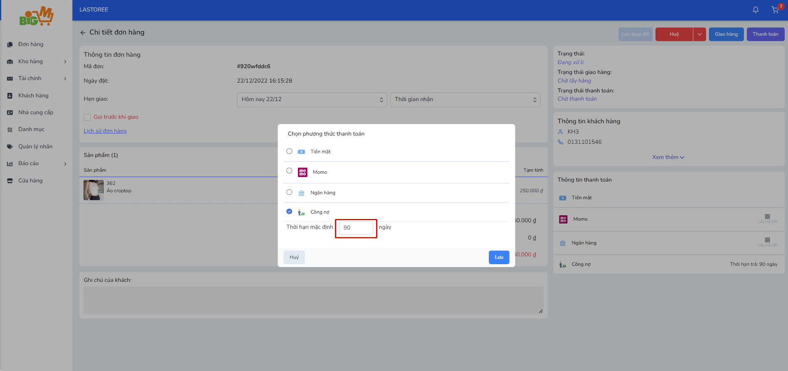
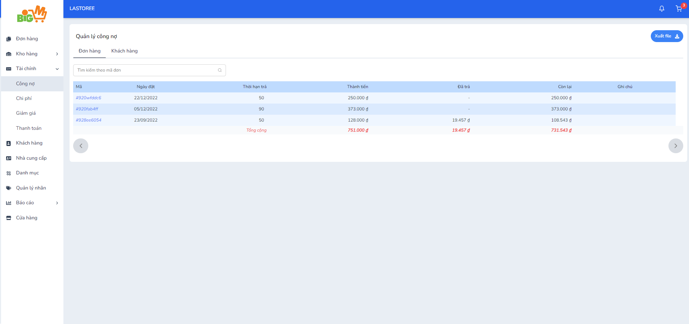
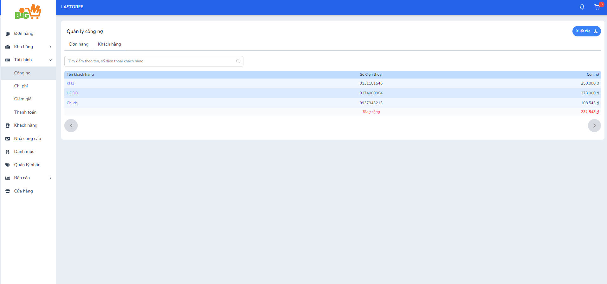
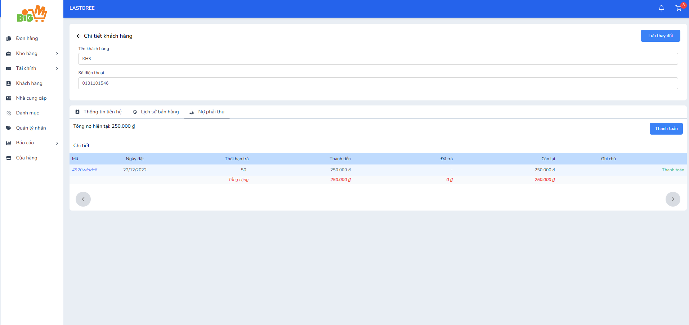
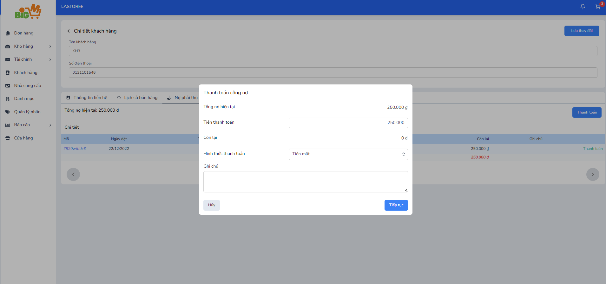
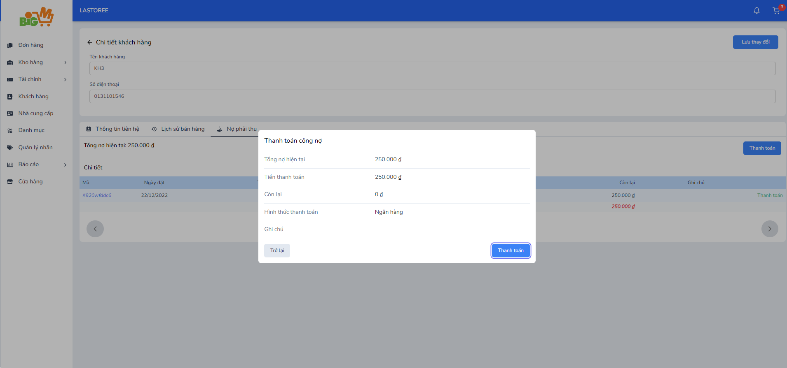
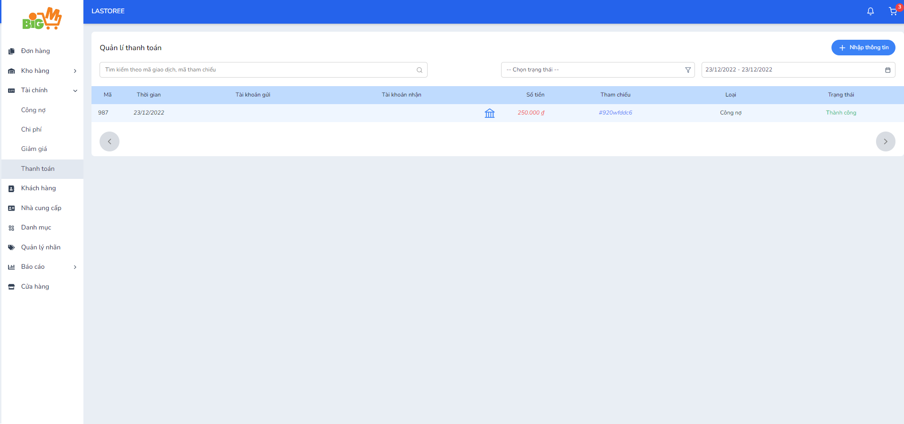

#   CÔNG NỢ 

### **Bước 1: Bật hình thức thanh toán công nợ ở trang cửa hàng**

- Chọn cập nhật hình thức tranh toán ở trang cửa hàng 

- Bật hình thức thanh toán công nợ, nhập thời hạn mặc định ( Tối đa 100 ngày)

### **Bước 2: Cập nhật hình thức thanh toán "Công nợ" với đơn hàng**

*Thời hạn mặc định có thể thay đổi*

### **Bước 3: Theo dõi công nợ trong trang "Quản lý công nợ"**

- Xem công nợ theo đơn hàng

- Xem công nợ theo khách hàng

### **Bước 4: Thanh toán công nợ**

- Nhấn chọn vào tên khách hàng ở trang quản lý công nợ hoặc vào trang chi tiết khách hàng để thực hiện thanh toán công nợ (Như hình minh họa)

- Chọn vào "Thanh toán", nhập thông tin thanh toán công nợ

- Kiểm tra lại thông tin trước khi xác nhận thanh toán, sau đó chọn "Thanh toán" để hoàn tất

- Sau khi thanh toán xong, trang "Quản lý thanh toán" sẽ ghi nhận thông tin giao dịch

