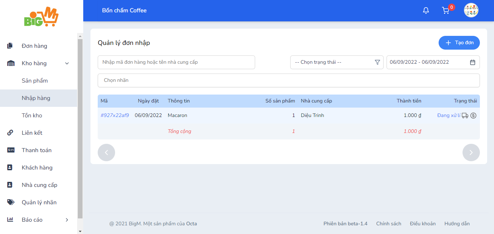
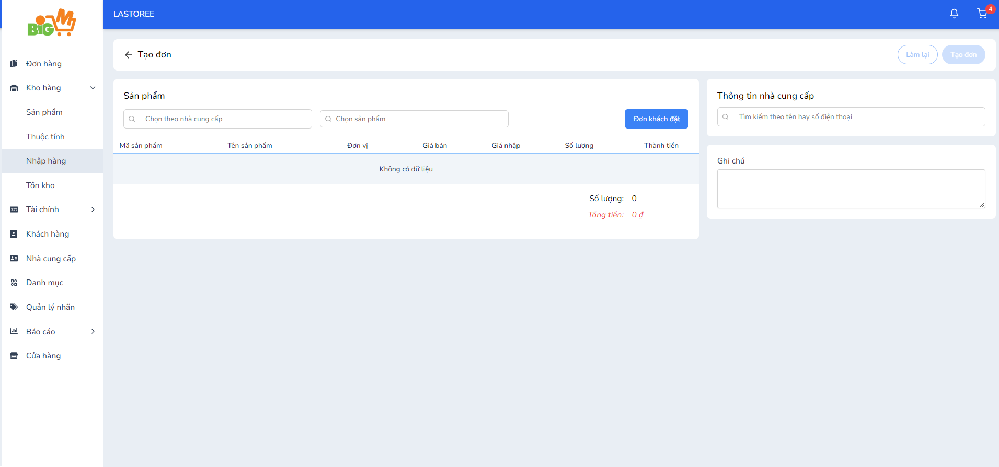

#  TẠO ĐƠN NHẬP 

### **Bước 1: Chọn chức năng "Nhập hàng" trên menu, chọn chức năng "Tạo đơn"**

 

### **Bước 2: Nhập thông tin vào đơn hàng **

- Chọn theo nhà cung cấp: Các sản phẩm của nhà cung cấp bạn chọn sẽ được hiển thị hết ở phía dưới lưới
- Chọn theo sản phẩm: Nhập hàng theo sản phẩm tùy ý
- Đơn khách đặt: Nhập hàng theo các đơn xuất được đặt trước từ khách hàng

### **Bước 3: Chọn "Lưu" để hoàn tất, chọn "Làm lại" để thao tác lại **