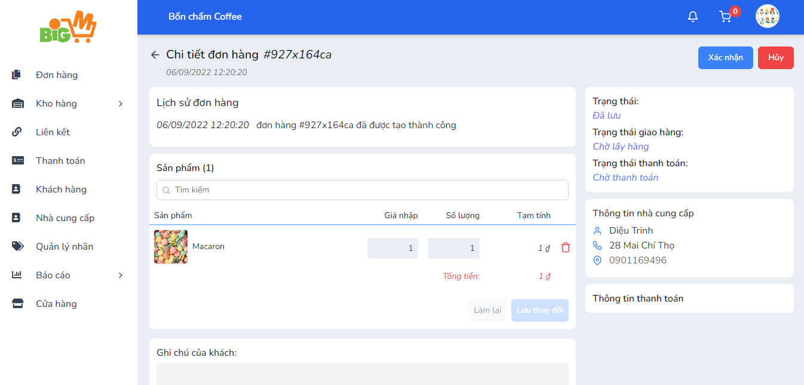

#  CẬP NHẬT TRẠNG THÁI ĐƠN NHẬP 

### **Bước 1: Chọn mã đơn nhập bạn muốn cập nhật trạng thái**

### **Bước 2: Trong chi tiết đơn nhập, các nút cập nhật trạng thái được hiện lên: **

- Xác nhận
- Hủy

### **Sau khi bạn xác nhận đơn hàng, các nút cập nhật trạng thái tiếp theo sẽ xuất hiện: **

- Giao hàng/ Đã giao
- Thanh toán
- Hoàn thành

