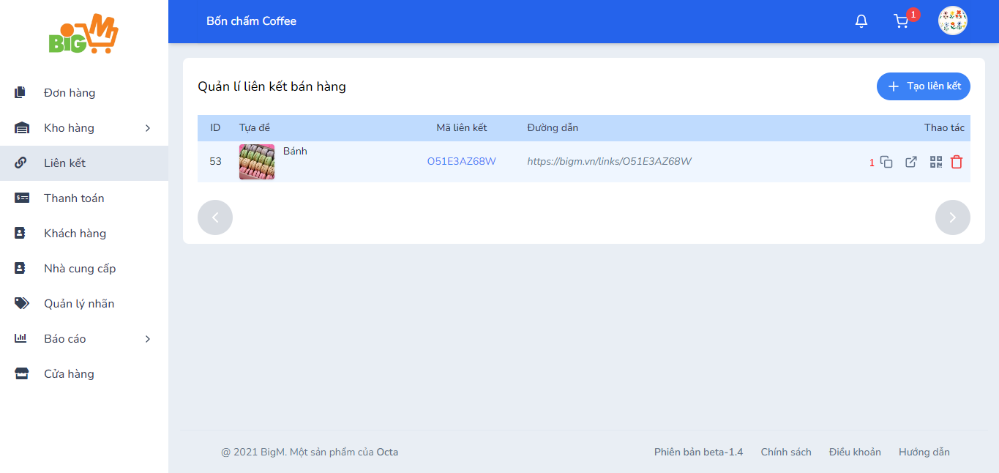
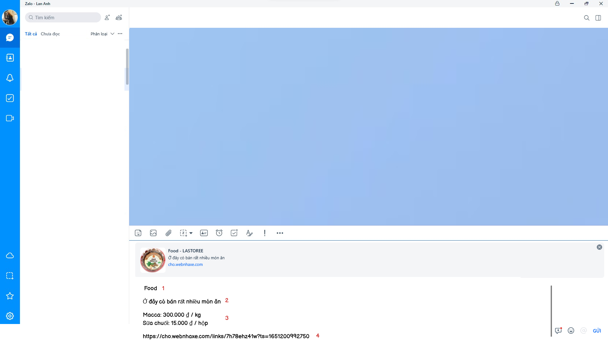

#  SAO CHÉP LIÊN KẾT SẢN PHẨM

### **Bước 1: Chọn chức năng "Sao chép liên kết (1)"**

### **Bước 2: Sau khi dán thông tin, sẽ hiển thị đầy đủ các thông tin: **

- Tựa đề liên kết
- Mô tả về liên kết
- Tên và giá các sản phẩm có trong liên kết
- Đường link của liên kết

