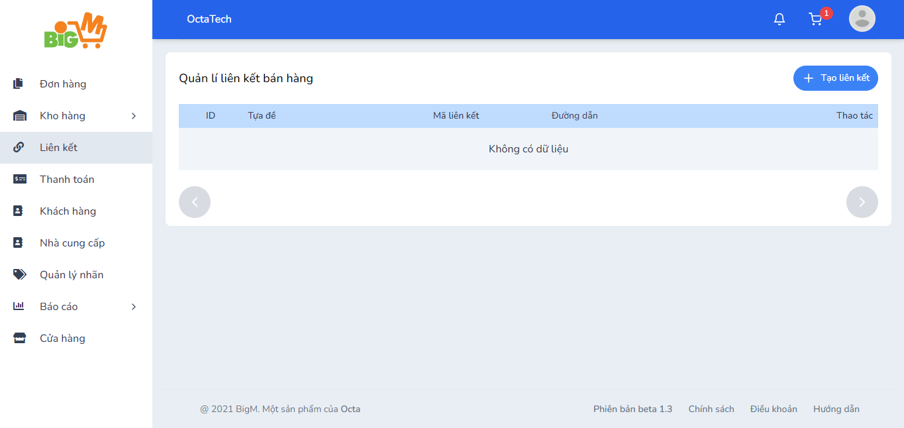
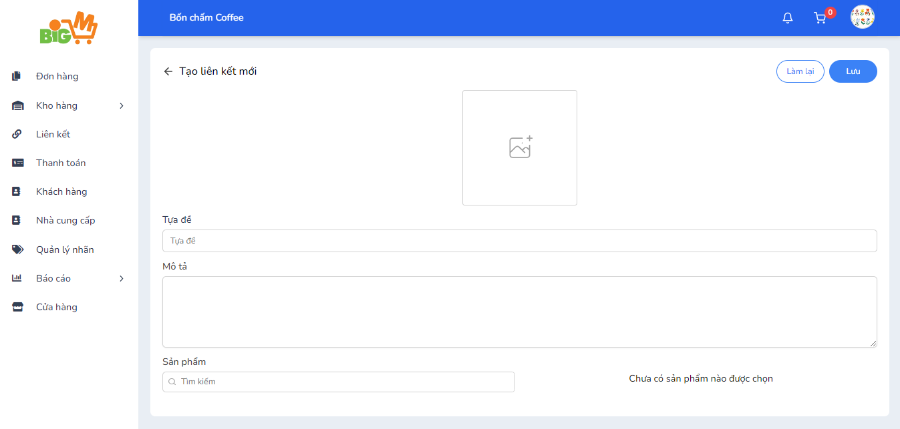

#  TẠO LIÊN KẾT SẢN PHẨM

### **Bước 1: Chọn "Tạo liên kết"**

### **Bước 2: Nhập các thông tin của liên kết sản phẩm**

- Tự đề của liên kết
- Mô tả liên kết    
- Chọn sản phẩm cho liên kết

### **Bước 3: Chọn "Lưu" để hoàn tất, chọn "Làm lại" để nhập lại thông tin**
