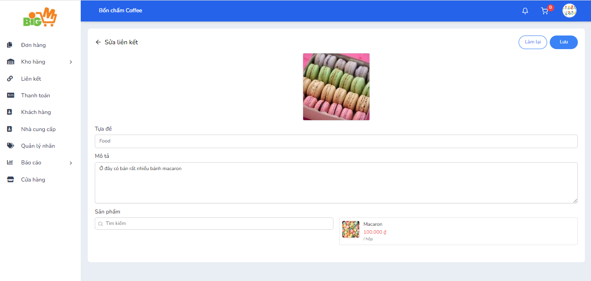

#  CHỈNH SỬA LIÊN KẾT SẢN PHẨM

### **Bước 1: Chọn vào mã của liên kết mà bạn muốn chỉnh sửa**

### **Chức năng tiện nghi: **

- Sao chép đường dẫn của liên kết (1)
- Mở liên kết bán hàng trong trang mới (2)
- Hiện mã QR của liên kết bán hàng (3)
- Chọn vào đây (4) nếu bạn muốn xóa liên kết bán hàng

### **Bước 2: Nhập các thông tin bạn muốn chỉnh sửa **

### **Bước 3: Chọn "Lưu" để hoàn thành, chọn "Làm lại" để thao tác lại**
