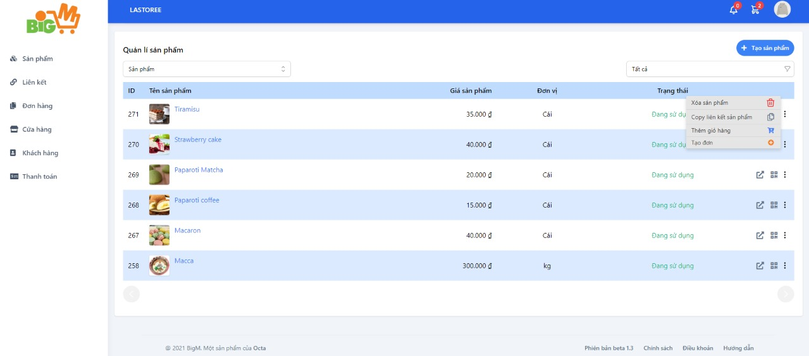
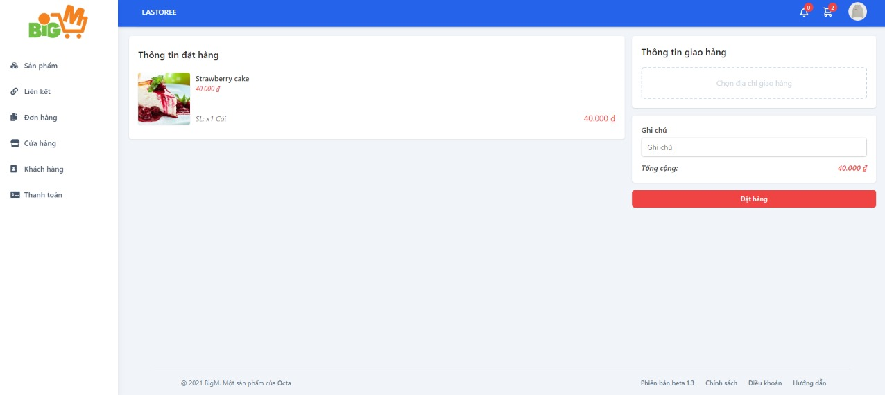

#  TẠO ĐƠN HÀNG 

### **Bước 1: Chọn vào chi tiết đơn hàng, sau đó chọn vào chức năng "Tạo đơn" như hình: **

### **Ngoài ra, còn có các chức năng như: **
 
 - Xóa sản phẩm
 - Copy liên kết sản phẩm
 - Thêm vào giỏ hàng
### **Bước 2: Tiếp theo bạn chọn thông tin giao hàng, thêm ghi chú (hoặc không)**

 

### **Bước 3: Chọn "Đặt hàng" để hoàn tất**