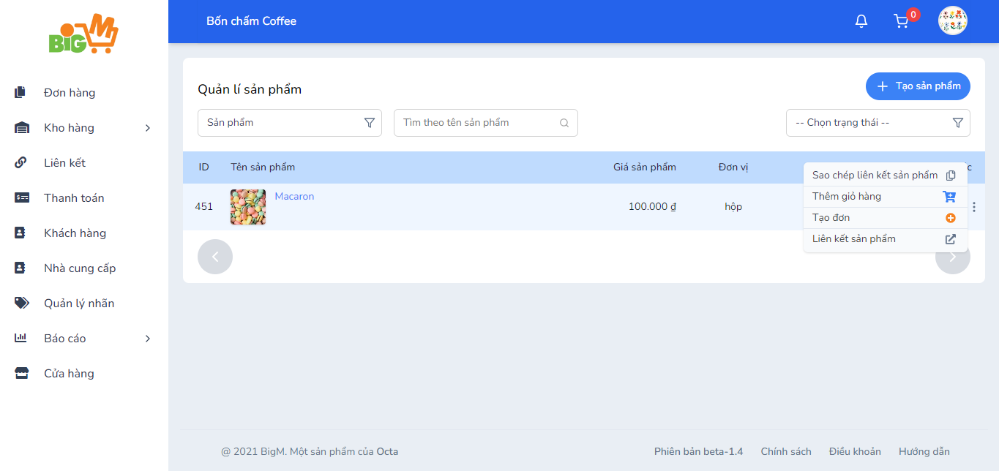
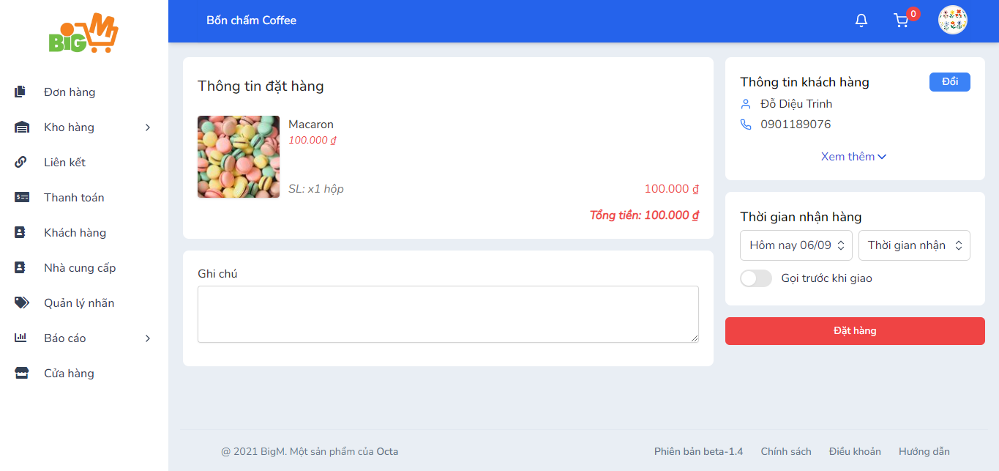

#  TẠO ĐƠN HÀNG 

### **Bước 1: Chọn chức năng "Tạo đơn" ở sản phẩm muốn tạo **

### **Bước 2: Chọn khách hàng đã tạo trước hoặc tạo mới khách hàng **

### **Bước 3: Tiếp theo bạn chọn thông tin giao hàng, thêm ghi chú (hoặc không)**

### **Bước 4: Chọn "Đặt hàng" để hoàn tất**

