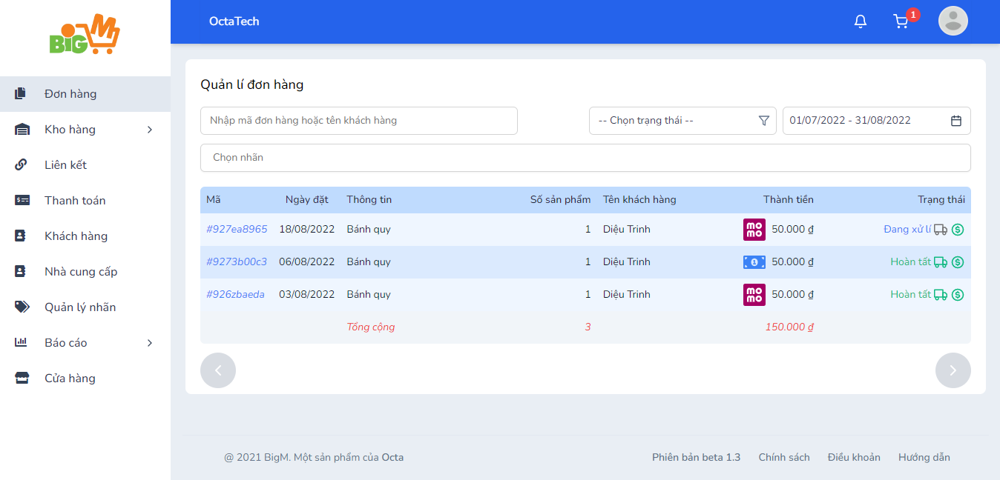
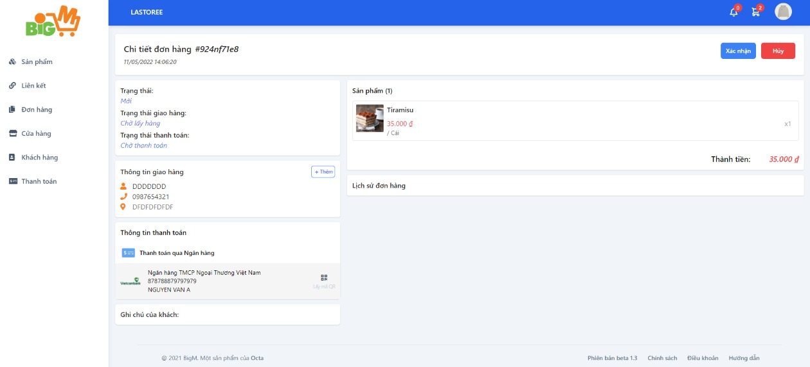

#  CẬP NHẬT TRẠNG THÁI ĐƠN HÀNG 

### **Bước 1: Chọn mã đơn hàng bạn muốn cập nhật trạng thái**

### **Bước 2: Trong chi tiết đơn hàng, các nút cập nhật trạng thái được hiện lên: **

- Xác nhận: Bạn đồng ý nhận đơn hàng của khách hàng
- Hủy: Bạn không đồng ý nhận đơn hàng của khách hàng

### **Sau khi bạn xác nhận đơn hàng, các nút cập nhật trạng thái tiếp theo sẽ xuất hiện: **

- Giao hàng/ Đã giao
- Đã thanh toán
- Hoàn tất 

