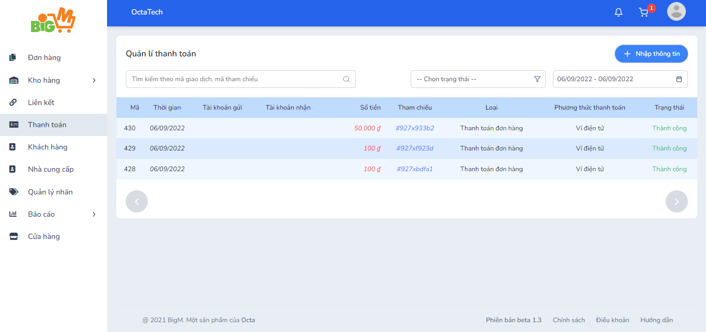
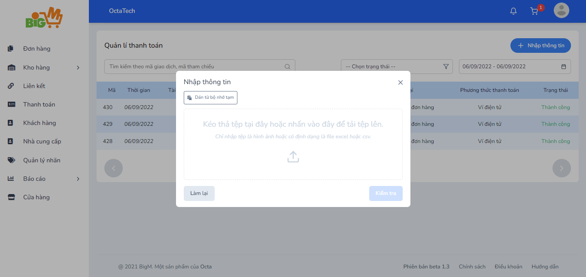
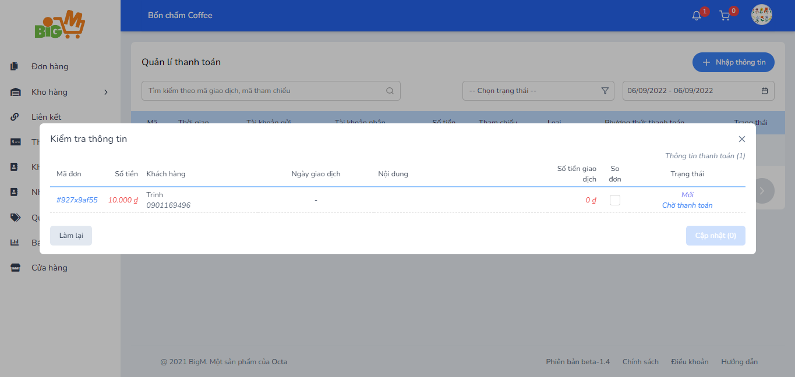
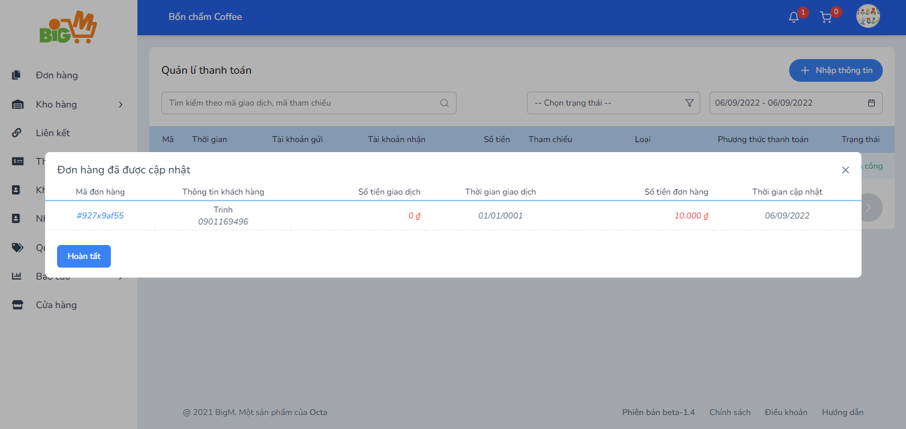

#  KIỂM TRA TÌNH TRẠNG THANH TOÁN ĐƠN HÀNG 

### **Bước 1: Chọn chức năng "Thanh toán" trên menu, chọn chức năng "Nhập thông tin"**

### **Bước 2: Màn hình hiện lên pop – up yêu cầu bạn kéo thả hình ảnh hoặc file **

### **Hoặc bạn có thể chọn chức năng “Dán từ bộ nhớ tạm” để paste thông tin từ bộ nhớ tạm. **

### **Chức năng “Kiểm tra” sẽ hiện sáng sau khi bạn update thông tin thành công. **

### **Bước 3: Hệ thống hiển thị thông tin để match đơn. Bạn kiểm tra và chọn chức năng “Cập nhật” **

### **Hiển thị thông tin các đơn hàng được cập nhật thành công **

### **Bước 4: Chọn “Hoàn tất” để quay về trang quản lý thanh toán **

                                                        
