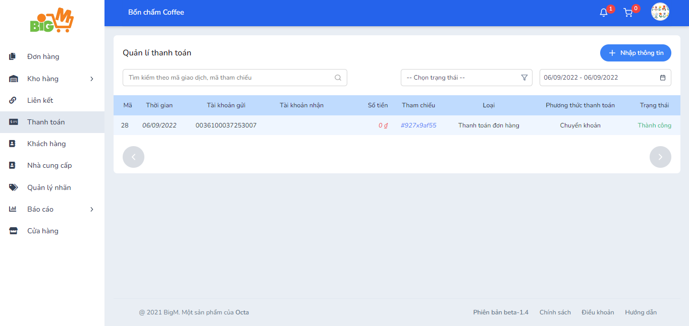

#  QUẢN LÝ THANH TOÁN 

### **Bước 1: Sau khi chọn “Cập nhật” ở chức năng kiểm tra tình trạng thanh toán của đơn hàng, hệ thống sẽ hiển thị các thông tin **

### **Bước 2: Bạn có thể: **
- Tìm kiếm thông tin bằng cách nhập mã giao dịch vào thanh tìm kiếm
- Chọn hiển thị thông tin theo trạng thái
- Chọn hiển thị thông tin theo thời gian (từ ngày – đến ngày)

