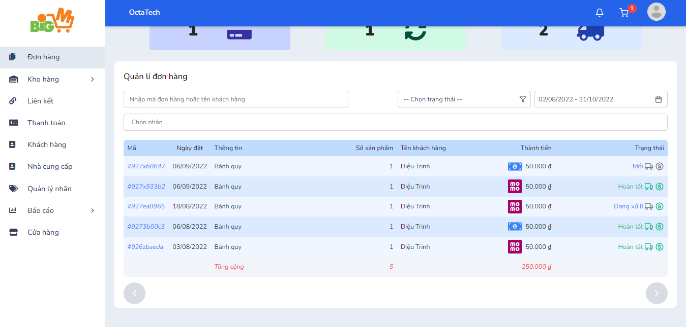
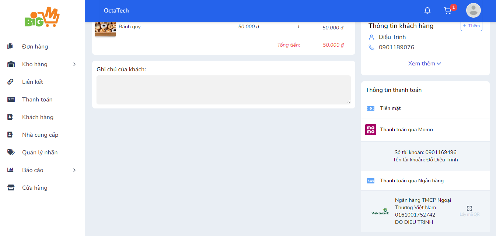

#  THANH TOÁN BẰNG MÃ QR 

### **Bước 1: Chọn đơn hàng bạn muốn thanh toán **

### **Bước 2: Trong chi tiết đơn hàng, chọn chức năng "Lấy mã QR" **

### **Bước 3: Sử dụng ứng dụng ngân hàng quét mã QR và xác nhận thanh toán **

