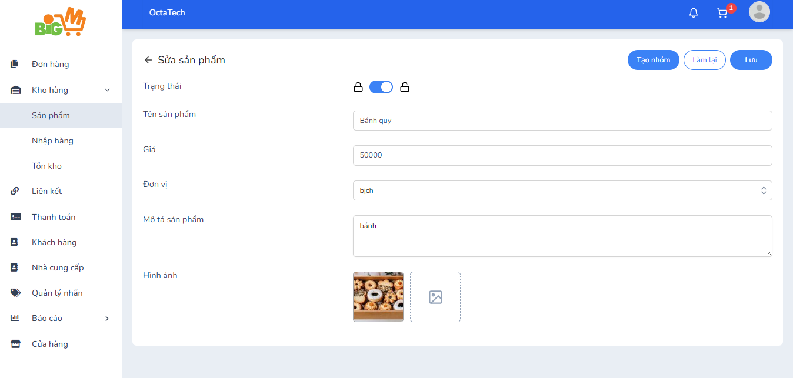

#  TẠO NHÓM SẢN PHẨM 

### **Bước 1: Chọn "Tạo Nhóm"**

### **Bước 2: Nhập các thông tin của nhóm sản phẩm**

- Tên nhóm sản phẩm
- Thêm sản phẩm vào nhóm (có thể thêm hoặc không)
- Thêm thông tin về thuộc tính sản phẩm 

### **Bước 3: Chọn "Lưu" để hoàn tất, chọn "Làm lại" để thao tác lại**