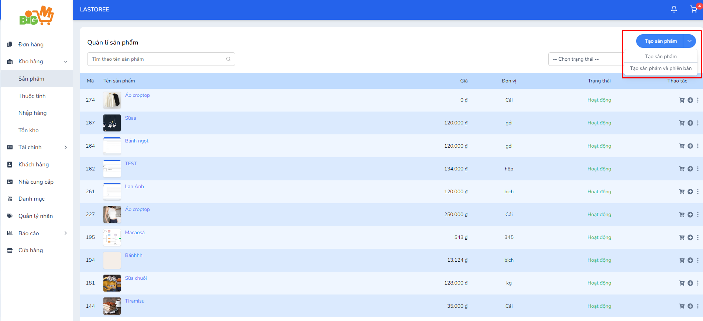

#  TẠO SẢN PHẨM 

### **Bước 1: Chọn "Tạo sản phẩm" hoặc chọn "Tạo sản phẩm và phiên bản"** 

### **Bước 2: Nhập các thông tin về sản phẩm**

*Mã SKU là duy nhất đối với mỗi sản phẩm và phiên bản của sản phẩm*

- Tạo sản phẩm

- Tạo sản phẩm và thuộc tính

Ở phần thuộc tính, chọn vào "Thêm thuộc tính", hệ thống sẽ hiển thị các thuộc tính đã tạo, sau đó chọn thuộc tính muốn thêm vào sản phẩm.

Bắt đầu tạo phiên bản cho sản phẩm bằng cách chọn vào "Thêm phiên bản", hệ thống sẽ hiển thị các thông tin đã được nhập sẵn từ phần Thông tin chung. Nhập mã SKU cho phiên bản, thêm hình ảnh và chọn giá trị của thuộc tính (Ví dụ: Đỏ - S)

Chọn "Thêm" để hoàn tất tạo 1 phiên bản cho sản phẩm. Lặp lại thao tác trên cho những lần tạo sau đó.

### **Bước 3: Chọn "Lưu" để hoàn tất, chọn "Làm lại" để nhập lại thông tin**
