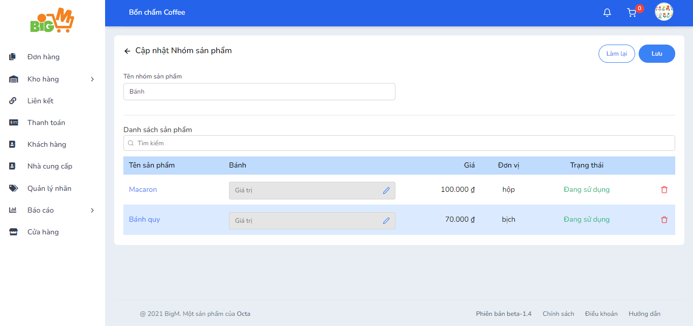

#  CẬP NHẬT NHÓM SẢN PHẨM 

### **Bước 1: Chọn vào mã nhóm sản phẩm bạn muốn chỉnh sửa

### **Bước 2: Nhập các thông tin bạn muốn chỉnh sửa hoặc thêm, xóa sản phẩm trong nhóm**

### **Bước 3: Chọn "Lưu" để hoàn tất, chọn "Làm lại" để thao tác lại**