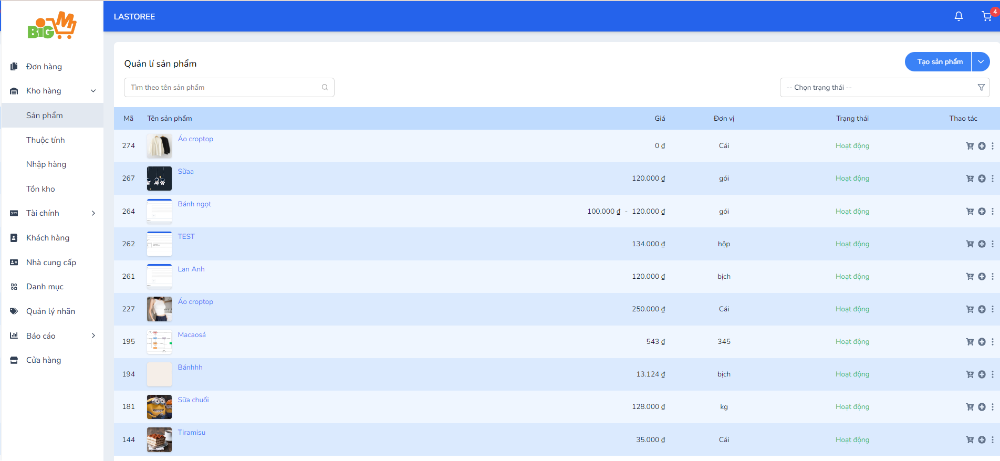

#  CHỈNH SỬA SẢN PHẨM

### **Bước 1: Chọn vào mã sản phẩm bạn muốn chỉnh sửa**

### **Bước 2: Nhập các thông tin bạn muốn chỉnh sửa**

- Nếu tắt nút "Trạng thái" của sản phẩm, người mua có thể sẽ không tìm thấy sản phẩm

### **Bước 3: Chọn "Lưu" để hoàn tất, chọn "Làm lại" để chính sửa lại thông tin**