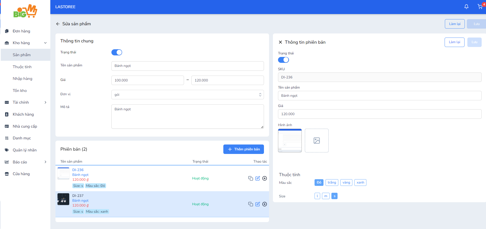

#  CHỈNH SỬA SẢN PHẨM

### **Bước 1: Chọn vào tên sản phẩm bạn muốn chỉnh sửa**

### **Bước 2: Nhập các thông tin bạn muốn chỉnh sửa**

*Nếu tắt nút "Trạng thái" của sản phẩm, người mua sẽ không tìm thấy sản phẩm*

*Không thể chỉnh sửa mã SKU, đơn vị của sản phẩm và phiên bản của sản phẩm*

- Sản phẩm không có phiên bản

- Sản phẩm có phiên bản

*Trong phiên bản sản phẩm, không thể chỉnh sửa mã SKU và giá trị thuộc tính đã chọn trước đó*

### **Bước 3: Chọn "Lưu" để hoàn tất, chọn "Làm lại" để chính sửa lại thông tin**