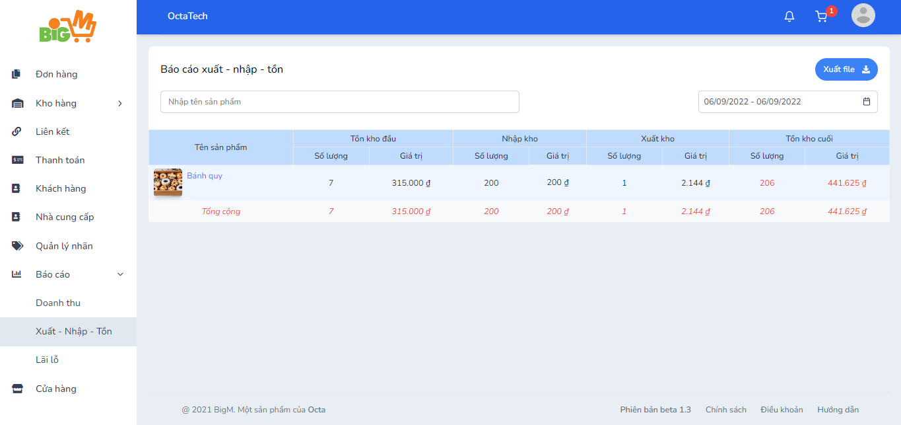

#  BÁO CÁO XUẤT - NHẬP - TỒN 

### **Bước 1: Chọn chức năng “Báo cáo”, chọn “Xuất - Nhập - Tồn” **

### **Bước 2: Có thể chọn xem báo cáo Xuất - Nhập - Tồn theo sản phẩm và thời gian đã chọn **

### **Bước 3: Có thể xuất file (nếu muốn) **