# [THÔNG TIN TÀI KHOẢN](<https://bigm.vn/me/profile>) 

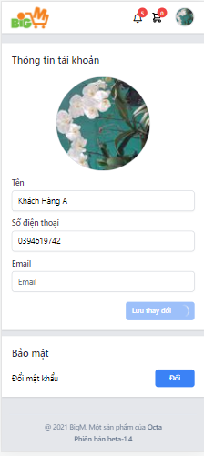

<strong><ol>
<li> Thay đổi thông tin tài khoản 
</li>

</strong>
 

 -Khi Khách hàng có nhu cầu thay đổi thông tin tài khoản thì nhập các thông tin cần thay đổi.
 <ol>
 <ul>
 <ul>
 <li>Hiện tại chỉ cho phép thay đổi Tên Khách hàng , nhập tên Khách hàng cần thay đổi
 </li>
 <li>Nhấn chọn<strong> LƯU THAY ĐỔI</strong>
 </li>
 </ul>
 </ul>
 
 </ol>
 

 -Khi Khách hàng có nhu cầu thay đổi mật khẩu thì phần thông tin Bảo mật nhấn chọn <strong>ĐỔI</strong>. Hiển thị màn hình Đổi mật khẩu:
</strong> 

 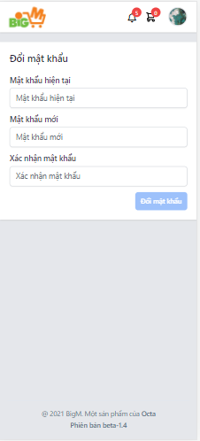
<strong>
<li> Đổi mật khẩu </li>
</strong>
<ol><ul><ul>
<li>Nhập Mật khẩu hiện tại </li>
<li>Nhập Mật khẩu mới </li>
<li>Nhập Xác nhận mật khẩu </li>
<li>Nhấn Đổi mật khẩu </li>
</ul>
</ul>
</ol>

# [ĐƠN HÀNG CỦA TÔI](<https://bigm.vn/me/orders>) 

 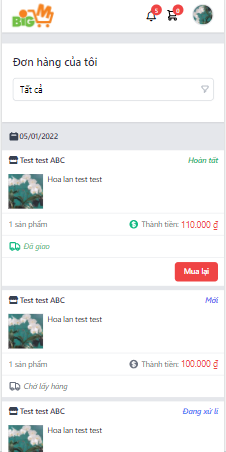
 

 -Ở avatar click chọn <strong> ĐƠN HÀNG CỦA TÔI</strong>. 
 <ol>
 <ul>
 <li>Hiển thị màn hình thông tin đơn hàng.
 </li>
 </ol>
 </ul>
  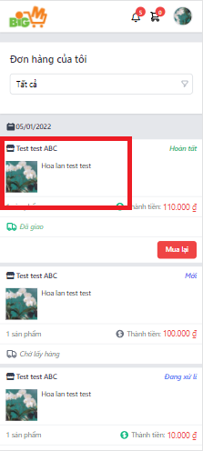
  <ol>
  <ul>
  <li>Chi tiết đơn hàng </li>
  <ul>
  <li>
  Click vào đơn hàng. Hiển thị màn hình chi tiết đơn hàng
  </ul>
  </li>
  </li> 
  </li>
  </ul>
  </ol>
   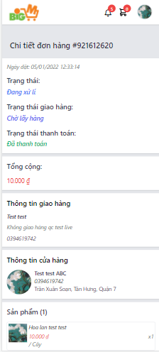

  
 

# [SỔ ĐỊA CHỈ](<https://bigm.vn/me/contacts>) 

 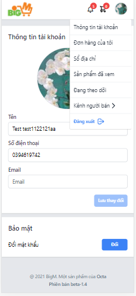
 

 -Ở avatar click chọn <strong> SỔ ĐỊA CHỈ CỦA TÔI</strong>. Hiển thị màn hình Sổ địa chỉ của tôi.
 

 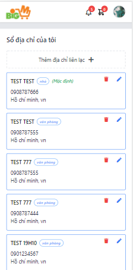

# [SẢN PHẨM ĐÃ XEM](<https://bigm.vn/me/viewed-products>) 

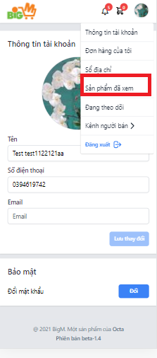

- Ở avatar click chọn <strong> SẢN PHẨM ĐÃ XEM</strong>. Hiển thị màn hình Sản phẩm đã xem.

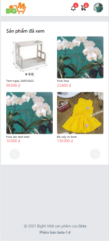

# [ĐANG THEO DÕI](<https://bigm.vn/me/subscribe>) 

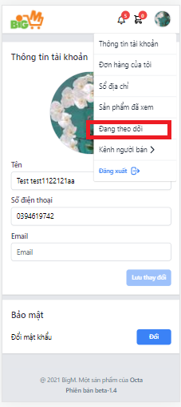

- Ở avatar click chọn <strong> ĐANG THEO DÕI</strong>. Hiển thị màn hình Đang theo dõi
<p.

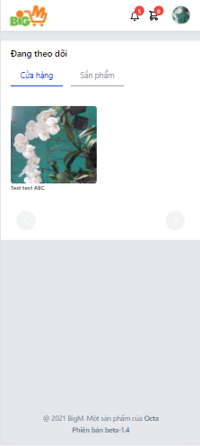

</ol>