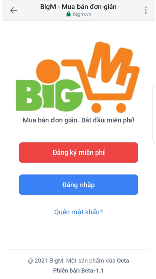
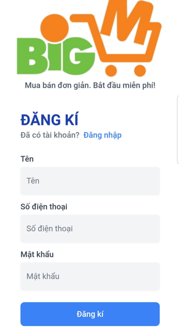
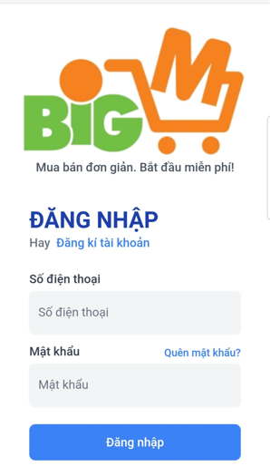
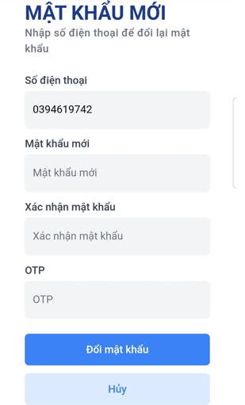

# [TRANG CHỦ](<https://bigm.vn/>) 
Bạn muốn mua hàng nhanh chóng tiện lợi xin chào mừng đến với BIGM: " Mua bán đơn giản. Bắt đầu miễn phí!

<strong><ol>
<li> Đăng ký tài khoản 
</li>
</strong> 

Nhấn vào nút <strong>[ĐĂNG KÝ MIỄN PHÍ](https://bigm.vn/auth/register) </strong>, thực hiện nhập các thông tin: 

<ul>
<li>Tên </li>
<li>Số điện thoại</li>
<li>Mật khẩu</li>
<li>Nhấn nút ĐĂNG KÝ</li>
</ul>

<Strong>
<li>Đăng nhập</li>
</strong> 

Khi Người bán hoặc Người mua đã có tài khoản thì nhấn nút <strong>[ĐĂNG NHẬP](https://bigm.vn/auth/login) </strong> và nhập các thông tin sau: 

<ul>
<li>Số điện thoại</li>
<li>Mật khẩu</li>
<li>Nhấn Đăng nhập</li>
</ul>

<Strong>
<li> Quên mật khẩu <https://bigm.vn/auth/reset-password> </li>
</strong> 

Khi Bạn quên mật khẩu, Bạn có thể lấy lại mật khẩu bằng cách nhấn vào  <strong>[QUÊN MẬT KHẨU](<https://bigm.vn/auth/reset-password>)</strong> và thực hiện nhập thông tin theo các bước sau:

<ul>
    <li>Số điện thoại</li>
    <li>Nhấn Tiếp tục

- Hiển thị màn hình  <strong>MẬT KHẨU MỚI</strong> nhập các thông tin: 

        <ul>
            <li>Số điện thoại</li>
            <li>Mật khẩu mới</li>
            <li>Xác nhận mật khẩu</li>
            <li>OTP</li>   
            <li>Nhấn Đổi mật khẩu</li> 
            </ul>

- Nếu không muốn reset mật khẩu thì 

        <ul>
            <li>Nhấn nút Hủy</li> 
            <li>Quay về màn hình Đăng nhập </li>
        </ul>
        
    </li>
</ul>

</ol>

