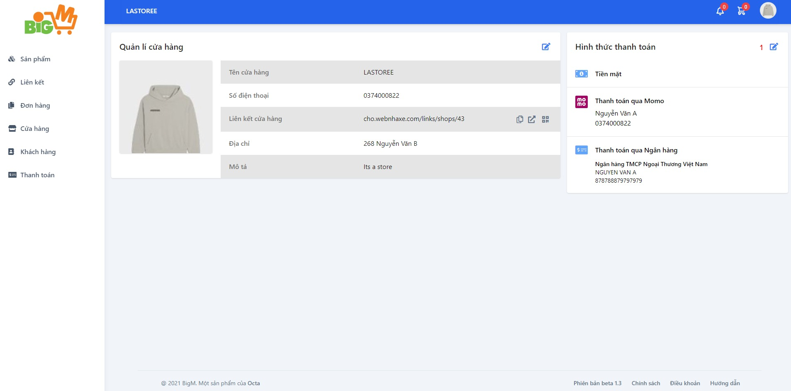
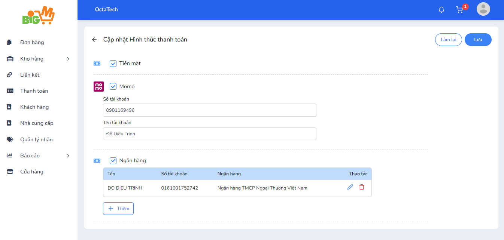

#  Cập nhật hình thức thanh toán 

### **Bước 1: Chọn chức năng "Cập nhật hình thức thanh toán"**

### **Bước 2: Thực hiện sửa đổi hình thức thanh toán mà bạn muốn: **

- Chọn ít nhất 1 trong 3 hình thức thanh toán: Tiền mặt, thanh toán qua Momo, thanh toán qua Ngân hàng
- Thay đổi tài khoản momo hoặc thêm, sửa, xóa tài khoản ngân hàng 

### **Bước 3: Chọn "Lưu" để hoàn tất, chọn "Làm lại" để làm lại từ đầu**

