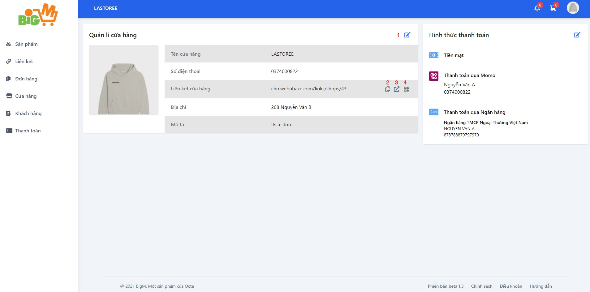
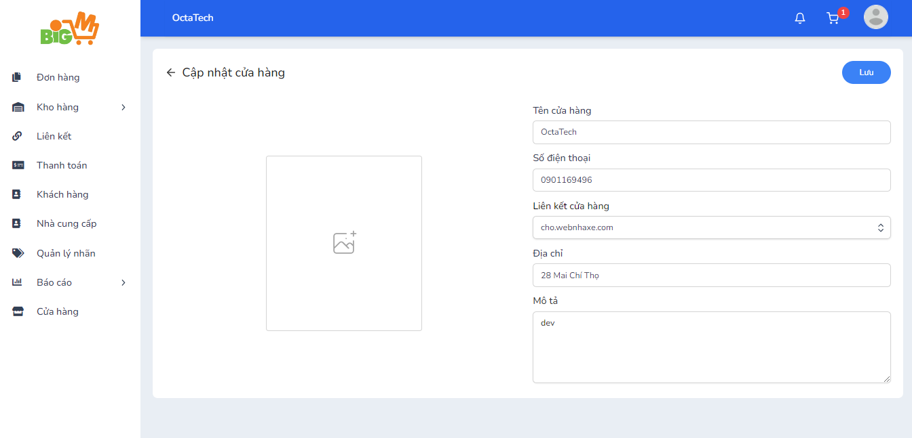

#  Cập nhật cửa hàng 

### **Bước 1: Chọn chức năng "Cập nhật cửa hàng (1)"**

### **Chức năng tiện nghi: **
- Sao chép liên kết cửa hàng (2)
- Mở cửa hàng trong trang mới (3)
- Hiện mã QR của shop (4)

### **Bước 2: Thựa hiện sửa đổi thông tin mà bạn muốn**

### **Bước 3: Chọn "Lưu" để hoàn tất**