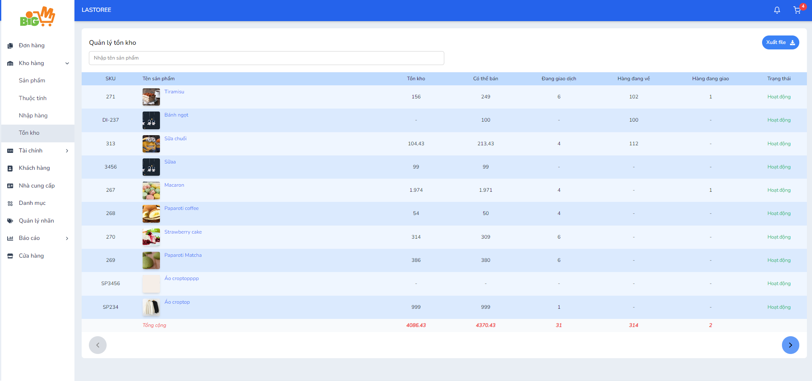

#  QUẢN LÝ TỒN KHO 

### **Bước 1: Chọn vào chức năng "Kho hàng" trên menu, chọn chức năng "Tồn kho" **

### **Bước 2: Hệ thống sẽ hiển thị theo các sản phẩm đã được nhập hàng trước đó **

*Người bán có thể tìm kiếm theo tên sản phẩm và xuất file*

