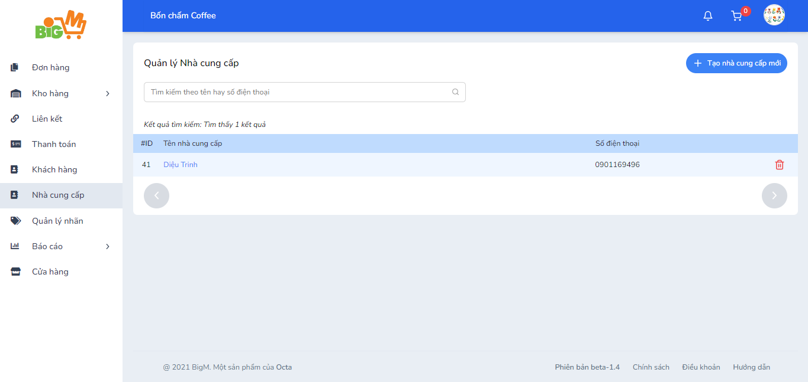
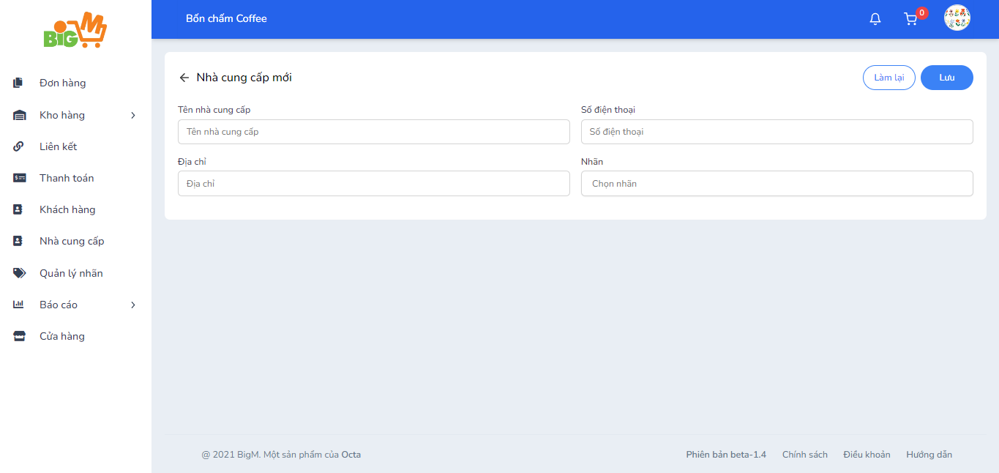

#  TẠO NHÀ CUNG CẤP MỚI 

### **Bước 1: Chọn chức năng "Tạo nhà cung cấp mới"**

### **Bước 2: Nhập thông tin của nhà cung cấp:**

- Tên nhà cung cấp
- Số điện thoại
- Địa chỉ
- Nhãn

### **Bước 3: Chọn "Lưu" để hoàn tất, chọn "Làm lại" để thao tác lại**