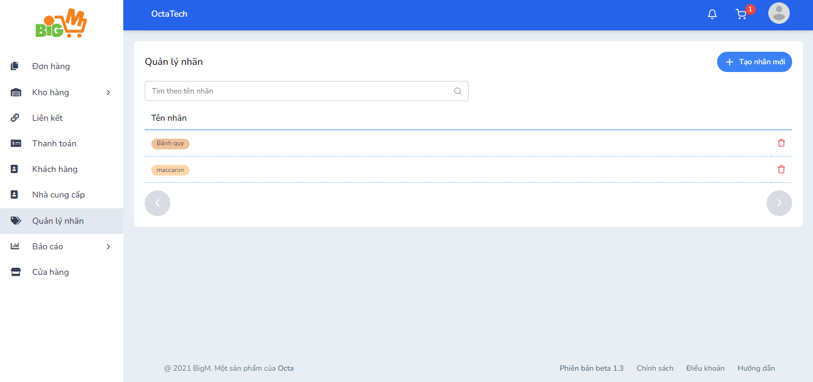
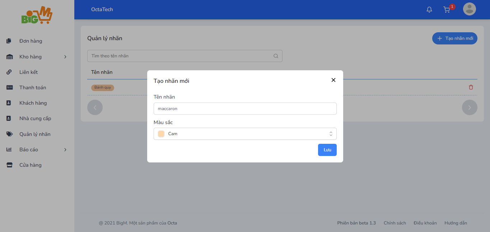

#  QUẢN LÝ NHÃN 

### **Bước 1: Chọn chức năng "Quản lý nhãn" trên menu, chọn chức năng "Tạo nhãn mới" **

### **Bước 2: Thêm thông tin: **

- Tên nhãn
- Màu sắc

### **Bước 3: Chọn “Lưu” để hoàn tất **