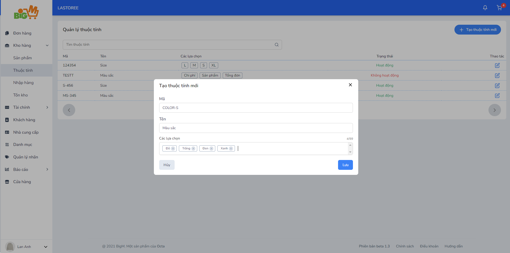

#  TẠO THUỘC TÍNH 

### **Bước 1: Chọn "Tạo thuộc tính mới" **

### **Bước 2: Nhập thông tin để tạo thuộc tính**

- Nhập lần lượt các thông tin như mã thuộc tính (Mã thuộc tính là duy nhất), tên thuộc tính
- Ở mục các lựa chọn, nhập tên lựa chọn và nhấn Enter để tạo một lựa chọn. Sau đó tiếp tục lặp lại thao tác cho các lựa chọn sau.

### **Bước 3: Nhấn "Lưu" để hoàn tất, chọn "Hủy" để hủy thao tác tạo**

