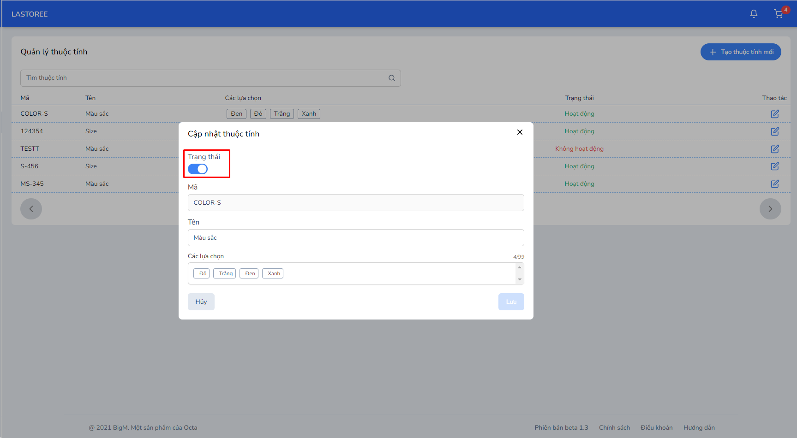

#   CHỈNH SỬA THUỘC TÍNH 

### **Bước 1: Chọn vào tên thuộc tính muốn chỉnh sửa** 

### **Bước 2: Chỉnh sửa thông tin thuộc tính**

- Có thể chỉnh sửa trạng thái hoạt động của thuộc tính
- Không thể chỉnh sửa mã thuộc tính và các lựa chọn đã tạo trước đó

### **Bước 3: Nhấn "Lưu" để hoàn tất, chọn "Hủy" để hủy chỉnh sửa**